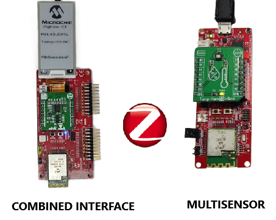

# PIC32CXBZ2 WBZ451HPE COMBINED INTERFACE WITH E-PAPER DISPLAY


> "IoT Made Easy!" 

Devices: **| PIC32CXBZ2 | WBZ451HPE |**<br>
Features: **| ZIGBEE | E-PAPER | MULTISENSOR |**


## ⚠ Disclaimer

<p><span style="color:red"><b>
THE SOFTWARE ARE PROVIDED "AS IS" AND GIVE A PATH FOR SELF-SUPPORT AND SELF-MAINTENANCE. This repository contains example code intended to help accelerate client product development. </br>

For additional Microchip repos, see: <a href="https://github.com/Microchip-MPLAB-Harmony" target="_blank">https://github.com/Microchip-MPLAB-Harmony</a>

Checkout the <a href="https://microchipsupport.force.com/s/" target="_blank">Technical support portal</a> to access our knowledge base, community forums or submit support ticket requests.
</span></p></b>

## Contents

1. [Introduction](#step1)
1. [Bill of materials](#step2)
1. [Hardware Setup](#step3)
1. [Software Setup](#step4)
1. [Harmony MCC Configuration](#step5) 
1. [Board Programming](#step6)
1. [Run the demo](#step7)
1. [Related Applications](#step8)

## 1. Introduction<a name="step1">

This application demonstrates the integration of the E-Paper Display and Zigbee (Combined Interface) stack on the PIC32CxBZ2/WBZ451H device. On startup the Combined Interface starts a centralized Zigbee network allowing other devices to join. The [Multisensor](https://github.com/MicrochipTech/PIC32CXBZ2_WBZ45x_ZIGBEE_MULTISENSOR_TEMPHUM13_CLICK) device joins the Zigbee network and reports the temperature & humidity data to the Combined Interface and CI displays it on the E-PAPER display.



| Tip | Go through the [overview](https://onlinedocs.microchip.com/oxy/GUID-A5330D3A-9F51-4A26-B71D-8503A493DF9C-en-US-7/GUID-668A6CB2-F1FB-438D-9E1E-D67AC3C1C132.html) for understanding few key Zigbee 3.0 protocol concepts |
| :- | :- |

## 2. Bill of materials<a name="step2">

| TOOLS | QUANTITY |
| :- | :- |
| [PIC32CX-BZ2 and WBZ451HPE Curiosity Development Board](https://www.microchip.com/en-us/development-tool/ev79y91a) | 1 |
| [E-Paper Bundle 2](https://www.mikroe.com/e-paper-bundle-2) | 1 |

## 3. Hardware Setup<a name="step3">

- Connect the E-Paper Bundle 2 with the WBZ451HPE CURIOSITY BOARD using the below table.


|     WBZ451HPE    |E-PAPER | Description |     WBZ451HPE    |E-PAPER | Description |
| :- | :- | :- | :- |:- | :- |
|     AN        |   NC  |   NC    |    PWM        |    16(D/C)|     Data/Command   |
|     RST       |    2(RST) |    RESET    |    INT        |    15(BSY)     |     BUSY      |
|     CS        |    3(CS)  | CHIP SELECT |    RX         |    NC     |     NC      |
|     SCK       |    4(SCK) |    SPI CLOCK   |    TX         |    NC     |     NC      |
|     MISO      |    NC     |    NC     |    SCL        |    NC     |     NC      |
|     MOSI      |    6(MOSI)|    SERIAL DATA INPUT     |    SDA        |    NC     |     NC      |
|     3.3V      |    7(3.3V)|    POWER SUPPLY      |    5V         |    NC     |     NC      |
|     GND       |    8 (GND)|    GROUND      |    GND        |    9 (GND)|     GROUND    |

| Note: Remove the R169 0ohm resistor from the WBZ451HPE Curiosity Board!! |
| --- |


## 4. Software Setup<a name="step4">

- [MPLAB X IDE ](https://www.microchip.com/en-us/tools-resources/develop/mplab-x-ide#tabs)

    - Version: 6.20
	- XC32 Compiler v4.45
	- MPLAB® Code Configurator v5.5.1
	- PIC32CX-BZ_DFP v1.4.243
	- MCC Harmony
	  - csp version: v3.19.7
	  - core version: v3.13.5
	  - CMSIS-FreeRTOS: v11.1.0
	  - wireless_pic32cxbz_wbz: v1.4.0
	  - wireless_zigbee: v6.1.0	
	  - wolfssl version: v5.4.0
	  - crypto version: v3.8.2
	    
- Any Serial Terminal application like [TERA TERM](https://download.cnet.com/Tera-Term/3000-2094_4-75766675.html) terminal application

- [MPLAB X IPE v6.20](https://microchipdeveloper.com/ipe:installation)

## 5. Harmony MCC Configuration<a name="step5">

### Getting started with Combined Interface application along with E-Paper Bundle 2 Display using WBZ451HPE Curiosity Development Board.

| Tip | New users of MPLAB Code Configurator are recommended to go through the [overview](https://onlineDocs.microchip.com/pr/GUID-1F7007B8-9A46-4D03-AEED-650357BA760D-en-US-6/index.html?GUID-AFAB9227-B10C-4FAE-9785-98474664B50A) |
| :- | :- |

**Step 1** - Connect the WBZ451HPE Curiosity Development Board to the device/system using a micro-USB cable.

**Step 2** - The project graph of the application is shown below.


**Step 3** - From Device resources, go to wireless->drivers->zigbee->Device types and select Combined Interface. Accept Dependencies or satisfiers, select "Yes". Add USART components needed for console logs and commands. Right click on the "⬦" in Zigbee console and add the satisfier and in the same way add SERCOM0 to the USART console as shown below.


**Step 4** - The SERCOM0 UART configuration is depicted as follows.


**Step 5** - Select Wolfcrypt library and make sure that "Support random number generation" box is unchecked as shown below.


**Step 6** - From Device resources, go to Harmony->Peripherals->SERCOM and select SERCOM2. Right click on the "⬦" on SPI and select SPI Driver. Accept Dependencies or satisfiers, select "Yes". The SERCOM2 configuration is depicted as follows.


**Step 7** - The SYSTEM configuration is depicted as follows.


**Step 8** - From project graph, go to Plugins->PIN configuration and configure as follows.

```
CLICK_EINK_BUNDLE_CS
SERCOM2_SPI_SCK
SERCOM2_SPI_MOSI
SERCOM2_SPI_MISO
CLICK_EINK_BUNDLE_DC
CLICK_EINK_BUNDLE_RST
CLICK_EINK_BUNDLE_BSY
```


**Step 9** - [Generate](https://onlineDocs.microchip.com/pr/GUID-A5330D3A-9F51-4A26-B71D-8503A493DF9C-en-US-1/index.html?GUID-9C28F407-4879-4174-9963-2CF34161398E) the code.

**Step 10** - From the unzipped folder copy the folder click_routines to the folder firmware->src under your MPLAB Harmony v3 application project.

- In the project explorer, Right click on folder Header Files and add a sub folder click_routines by selecting “Add Existing Items from Folders…”


- Click on “Add Folder…” button.


- Select the “click_routines” folder and select “Files of Types” as Header Files.


- Click on “Add” button to add the selected folder.


- The eink bundle header files gets added to your project.


- In the project explorer, Right click on folder Source Files and add a sub folder click_routines by selecting “Add Existing Items from Folders…”.


- Click on “Add Folder…” button


- Select the “click_routines” folder and select “Files of Types” as Source Files.


- Click on “Add” button to add the selected folder


- The eink bundle source files gets added to your project.


- The click_routines folder contain an C source file eink_bundle.c. You could use eink_bundle.c as a reference to add E-Paper display functionality to your application.

**Step 11** - Change the following Code as givien below.

- In your MPLAB Harmony v3 based application go to "firmware\src\app_user_edits.c", make sure changes are implemented and the below code line is commented.

```
//#error User action required - manually edit files as described here.
```

- In your MPLAB Harmony v3 based application go to "firmware\src\app.h" and do the following changes.

	- Copy & Paste the Code in [app.h](https://github.com/MicrochipTech/PIC32CXBZ2_WBZ45xH_ZIGBEE_CI_E_PAPER_DISPLAY/blob/main/WBZ451_E_PAPER_Zigbee_CI/firmware/src/app.h)

- In your MPLAB Harmony v3 based application go to "firmware\src\app.c" and do the following changes.

	- Copy & Paste the Code in [app.c](https://github.com/MicrochipTech/PIC32CXBZ2_WBZ45xH_ZIGBEE_CI_E_PAPER_DISPLAY/blob/main/WBZ451_E_PAPER_Zigbee_CI/firmware/src/app.c)

- In your MPLAB Harmony v3 based application go to "firmware\src\app_zigbee\app_zigbee_handler.c" and do the following changes.

	- Copy & Paste the Code in [app_zigbee_handler.c](https://github.com/MicrochipTech/PIC32CXBZ2_WBZ45xH_ZIGBEE_CI_E_PAPER_DISPLAY/blob/main/WBZ451_E_PAPER_Zigbee_CI/firmware/src/app_zigbee/app_zigbee_handler.c)
	
- In your MPLAB Harmony v3 based application go to "firmware\src\config\default\zigbee\z3device\common\z3DevicePic32cx.c" and do the following changes.

	- Copy & Paste the Code in [z3DevicePic32cx.c](https://github.com/MicrochipTech/PIC32CXBZ2_WBZ45xH_ZIGBEE_CI_E_PAPER_DISPLAY/blob/main/WBZ451_E_PAPER_Zigbee_CI/firmware/src/config/default/zigbee/z3device/common/z3DevicePic32cx.c)
		
- Go to source files->config->default->zigbee->z3device->combinedInterface->combinedInterface.c and add the below code.

	```
	LCD_INIT();

	LCD_PRINT(0, 1, " Zigbee CI");
	```
	
	

- Go to header files->config->default->zigbee->z3device->common->include->z3Device.h, add the following code in the Includes section.

	```
	#include "click_routines/eink_bundle/eink_bundle.h"
	#include "click_routines/eink_bundle/eink_bundle_image.h"
	#include "click_routines/eink_bundle/eink_bundle_font.h"
	```
	- In "z3Device.h", replace the code in line 89 and 90 with the below code.

	```
	  #define LCD_INIT()                                  e_paper_initialize()
	  #define LCD_PRINT(...)                              e_paper_print(__VA_ARGS__)
	```
- Go to source files->config->default->zigbee->z3device_configs->zigbeeAppDeviceSelct.h and change the code in line 80.

	```
	#define CS_UID 0x130620bee 
	```

**Step 12** - Clean and build the project. To run the project, select "Make and program device" button.

**Step 13** - The data is printed onto the tera term and E-Paper display.

- Baud rate: 115200
- Com port: COM USB serial port

### Programming the ZigBee End Device (MULTISENSOR)

- The Zigbee end-device application is available in this [MULTISENSOR](https://github.com/MicrochipTech/PIC32CXBZ2_WBZ45x_ZIGBEE_MULTISENSOR_TEMPHUM13_CLICK). Follow the steps provided to program the Multisensor application.

## 6. Board Programming<a name="step6">

## Programming hex file:

### Program the precompiled hex file using MPLAB X IPE

- The Precompiled hex file is given in the hex folder.
Follow the steps provided in the link to [program the precompiled hex file](https://microchipdeveloper.com/ipe:programming-device) using MPLABX IPE to program the pre-compiled hex image.

### Build and program the application using MPLAB X IDE

The application folder can be found by navigating to the following path: 

- "WBZ451_E_PAPER_Zigbee_CI\firmware\WBZ451HPE_ZIGBEE_EPAPER.X"

Follow the steps provided in the link to [Build and program the application](https://github.com/Microchip-MPLAB-Harmony/wireless_apps_pic32cxbz2_wbz45/tree/master/apps/ble/advanced_applications/ble_sensor#build-and-program-the-application-guid-3d55fb8a-5995-439d-bcd6-deae7e8e78ad-section).

## 7. Run the demo<a name="step7">

- After programming the board, the expected application behavior is shown in the below [video](https://github.com/MicrochipTech/PIC32CXBZ2_WBZ45xH_ZIGBEE_CI_E_PAPER_DISPLAY/blob/main/docs/CI.gif). In this application the [MULTISENSOR](https://github.com/MicrochipTech/PIC32CXBZ2_WBZ45x_ZIGBEE_MULTISENSOR_TEMPHUM13_CLICK) reports the set temperature and humidity values to a [coordinator device](https://github.com/MicrochipTech/PIC32CXBZ2_WBZ45xH_ZIGBEE_CI_E_PAPER_DISPLAY).


## 8. Related applications<a name="step8">

- [ZigBee Applications](https://github.com/Microchip-MPLAB-Harmony/wireless_apps_pic32cxbz2_wbz45/tree/master/apps/zigbee)
- [Smart Home Thermostat](https://github.com/MicrochipTech/PIC32CXBZ2_WBZ45x_Zigbee_Home_Thermostat)


